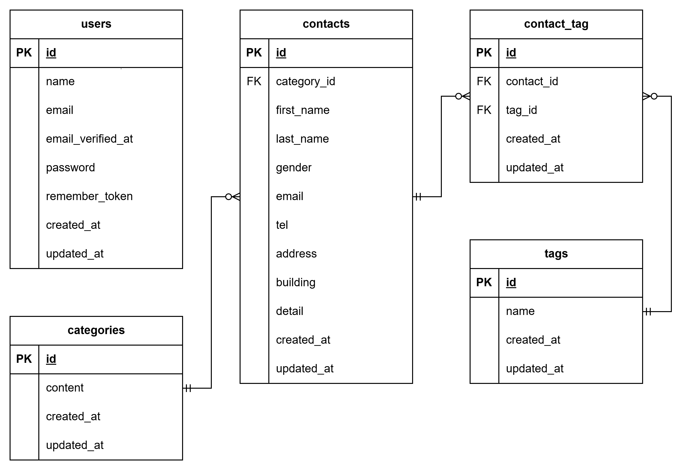

# contact-form-app

## プロジェクト名
COACHTECH お問い合わせフォーム

## 概要
COACHTECHの確認テストとして作成した成果物です。
お問い合わせフォームからお問い合わせの入力・確認・送信が行えます。
管理者はお問い合わせ一覧とその詳細を確認/削除することができます。
また、お問い合わせのタグを新規作成/編集/削除することができます。

## ER図


## 環境構築手順
```bash
1.プロジェクトの配置場所へ移動
# フォルダ作成
mkdir laravel-practice
cd laravel-practice

2.クローンを取得
# クローン
git clone https://github.com/Hayashi-0506/contact-form-app.git contact-form-app
cd contact-form-app

3.Laravel Sailのインストール
# Laravel Sailをインストール
docker run --rm \
    -u "$(id -u):$(id -g)" \
    -v "$(pwd):/var/www/html" \
    -w /var/www/html \
    -e COMPOSER_CACHE_DIR=/tmp/composer_cache \
    laravelsail/php82-composer:latest \
    composer require laravel/sail --dev

# Sailの設定ファイルをパブリッシュ（MySQLを選択）
docker run --rm \
    -u "$(id -u):$(id -g)" \
    -v "$(pwd):/var/www/html" \
    -w /var/www/html \
    -e COMPOSER_CACHE_DIR=/tmp/composer_cache \
    laravelsail/php82-composer:latest \
    php artisan sail:install --with=mysql

# ※M1/M2/M3 Mac（Apple Silicon）をお使いの方

Apple Silicon搭載のMacでは、`sail up -d`実行時に以下のエラーが発生することがあります：

``
no matching manifest for linux/arm64/v8
``
解決方法: `compose.yaml`を開き、mysqlサービスに`platform: 'linux/amd64'`を追加してください。
mysql:
    image: 'mysql/mysql-server:8.0'
    platform: 'linux/amd64'  # ← この行を追加
    ports:

4. .env ファイルの設定
#.env ファイルを開き、データベース接続情報が以下と一致していることを確認します。
DB_CONNECTION=mysql
DB_HOST=mysql
DB_PORT=3306
DB_DATABASE=laravel
DB_USERNAME=sail
DB_PASSWORD=password

5. フロントエンドのセットアップ (Vite & Tailwind CSS)
本プロジェクトでは、フロントエンドのスタイリングにTailwind CSSを使用します。

# 1. NPM依存パッケージのインストール
> 重要: sail npm install を実行する前に、必ずSailコンテナが起動していることを確認してください。
sail npm install

# 2. Tailwind CSSのインストール
sail npm install -D tailwindcss@^3.4.0 postcss autoprefixer
sail npm install alpinejs

# 3. 設定ファイルの生成
sail npx tailwindcss init -p

# 4. Tailwind CSSのテンプレートパス設定
tailwind.config.js を開き、以下のように設定します。
/** @type {import("tailwindcss").Config} */
export default {
  content: [
    "./resources/**/*.blade.php",
    "./resources/**/*.js",
    "./resources/**/*.vue",
  ],
  theme: {
    extend: {},
  },
  plugins: [],
}

# 6. Vite開発サーバーの起動
sail npm run dev
注意: sail npm run dev は実行したままにしておく必要があります。

6. phpMyAdminの追加
#compose.yaml を開き、mysql サービスの後に以下の設定を追加してください。

compose.yaml に追加する内容:

    phpmyadmin:
        image: 'phpmyadmin:latest'
        ports:
            - '${FORWARD_PHPMYADMIN_PORT:-8080}:80'
        environment:
            PMA_HOST: mysql
            PMA_USER: '${DB_USERNAME}'
            PMA_PASSWORD: '${DB_PASSWORD}'
        networks:
            - sail
        depends_on:
            - mysql

7. Sailの起動とエイリアス設定
# Sailをバックグラウンドで起動
./vendor/bin/sail up -d

# エイリアスを設定して 'sail' だけでコマンドを実行できるようにする
echo "alias sail='[ -f sail ] && bash sail || bash vendor/bin/sail'" >> ~/.zshrc

# または bash の場合
# echo "alias sail='[ -f sail ] && bash sail || bash vendor/bin/sail'" >> ~/.bashrc

# シェルを再起動するか、新しいターミナルを開いてエイリアスを有効にする
exec $SHELL

8. アプリケーションキーの生成
#ルートで以下のコマンドを実行する
sail artisan key:generate

9. データベースのマイグレーションと初期データ投入
# 以下のコマンドでテーブルを作成し、初期データを投入します。
sail artisan migrate --seed

# ※既存のデータベースをリセットしたい場合は以下を実行してください。
sail artisan migrate:fresh --seed
```

## 使用技術
- PHP 8.5.7
- Laravel 10.x + Sail
- DB : MySQL 8.0
- Webサーバー : Nginx
- フロントエンド : Vite, Tailwind CSS ^3.4.0
- 開発ツール : Docker, Laravel Sail, phpMyAdmin

## APIエンドポイント一覧

## 開発環境URL
- お問い合わせ画面：http://localhost
- 管理者画面：http://localhost/admin

## 開発者
- 林 佑一